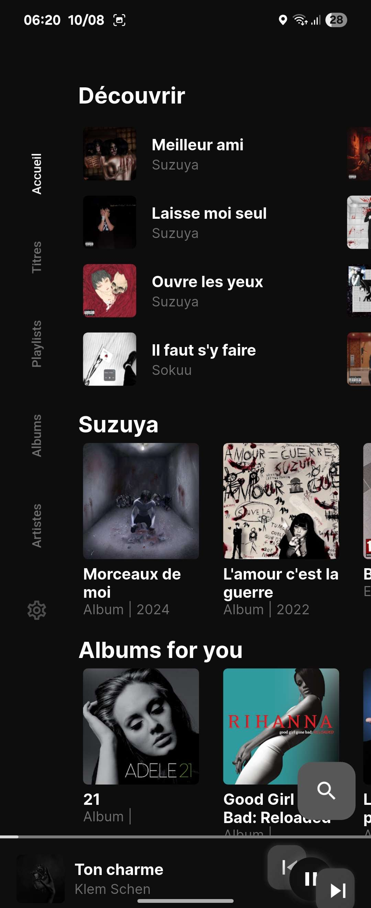
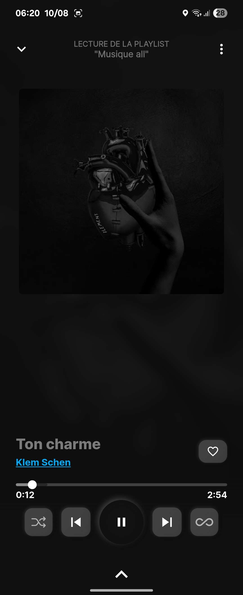
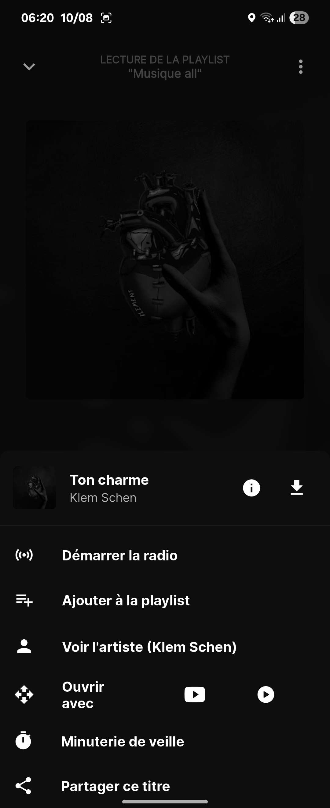
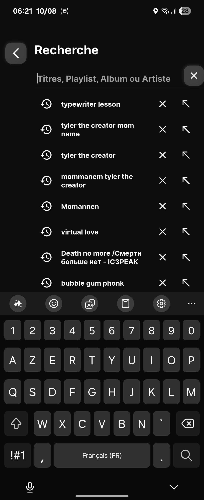
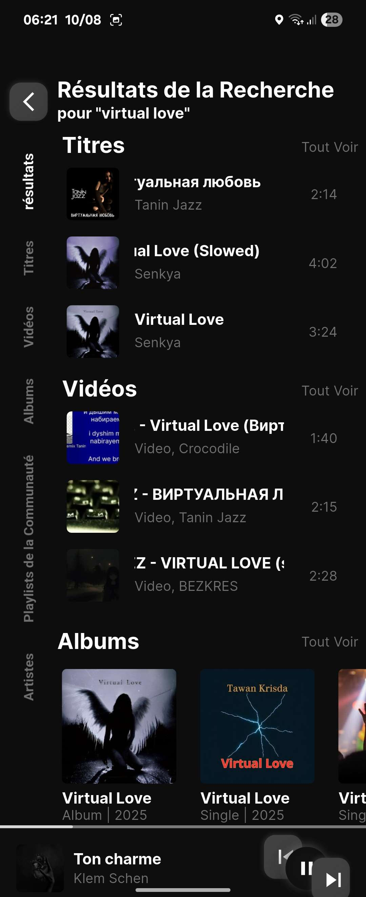
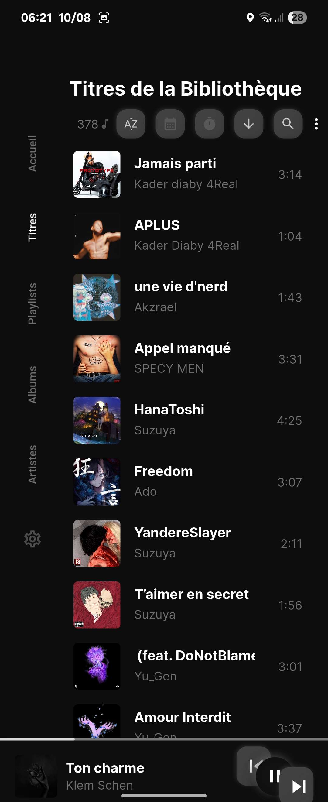
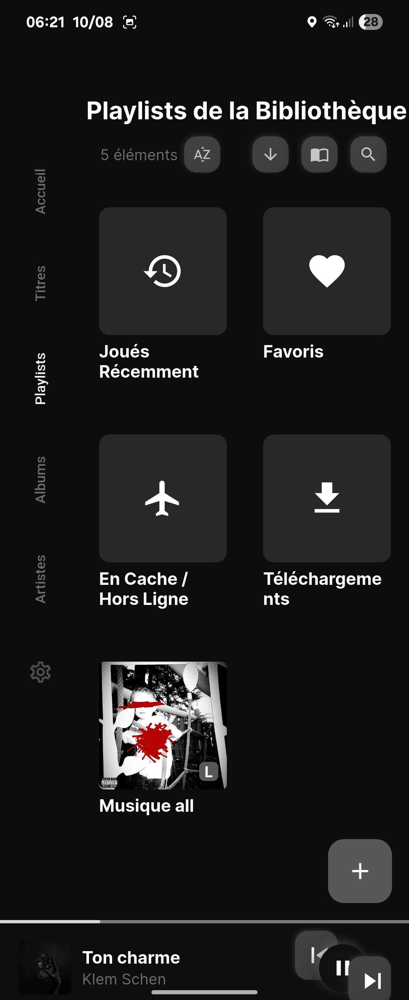
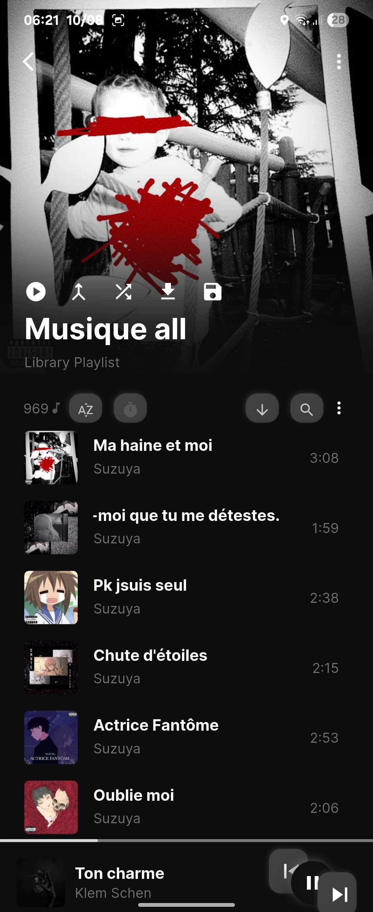
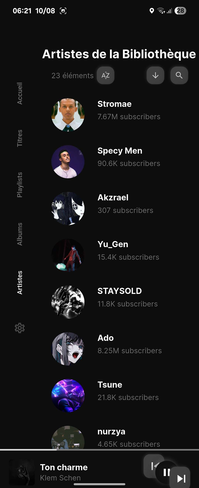
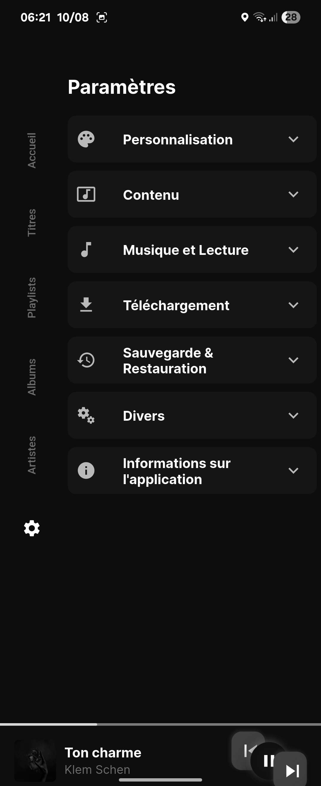

<div align="center">

<!-- Header with animated wave -->


<!-- Profile view with animated stats -->
<p align="center">
  
  
</p>

<!-- Animated typing effect with more style -->


<!-- Enhanced decorative elements -->


<!-- Activity Graph -->


<!-- Status badges with animations -->
<p>


</p>

<!-- Social proof section -->
<p>


</p>

<!-- Visitor counter -->
<p align="center">

</p>

</div>

---

<div align="center">

## 🌟 **About AMADEUSE MUSIC**


<!-- Project showcase with enhanced visuals -->
<table>
<tr>
<td align="center" width="33%">

<br/><b>YouTube Music Integration</b>
</td>
<td align="center" width="33%">

<br/><b>Android, Windows, Linux</b>
</td>
<td align="center" width="33%">

<br/><b>Flutter Powered</b>
</td>
</tr>
</table>

</div>

```typescript
class AmadeuseMusic {
    name = "AMADEUSE MUSIC"
    version = "2.0.0"
    description = "Cross-platform Music Streaming Application"
    status = "🚀 Production Ready"
    mission = "Bringing music to everyone, everywhere"
    platform = "Flutter (Android, Windows, Linux)"
    technologies = ["Flutter", "Dart", "YouTube Music API", "Cross-Platform"]
    
    getFeatures(): string[] {
        return [
            "🎵 YouTube/YouTube Music streaming",
            "📱 Cross-platform compatibility",
            "🎧 High-quality audio playback",
            "📂 Playlist management",
            "🎨 Dynamic themes and UI customization"
        ]
    }
    
    sayHello(): string {
        return `Welcome to ${this.name}! 🎵`
    }
    
    getStatus(): string {
        return `${this.status} - Music for everyone 🎵🚀`
    }
}

const amadeuseMusic = new AmadeuseMusic()
console.log(amadeuseMusic.sayHello())
```

<div align="center">

## 🚀 **Key Features**


<!-- Feature highlights with icons -->
<table>
<tr>
<td align="center">

</td>
<td align="center">

</td>
<td align="center">

</td>
</tr>
</table>

<table>
<tr>
<td width="50%" align="center">

### 🎵 **Music Streaming**


**Advanced Music Experience**

🎵 **Core Features:**
- 🎵 **YouTube/YouTube Music** streaming
- 💾 **Song caching** while playing
- 📻 **Radio feature** support
- 🎵 **Background music** playback
- 📂 **Playlist creation** & bookmarks
- 🎤 **Artist & Album** bookmarks
- 📤 **Import via sharing** from YouTube Music
- ⚙️ **Streaming quality** control
- 📥 **Song downloading** support

[](https://github.com/AveryMist/AMADEUSE-MUSIC/releases)

</td>
<td width="50%" align="center">

### ⚡ **Advanced Features**


**Enhanced User Experience**

⚡ **Premium Features:**
- 🌐 **Language support** - Multiple languages
- ⏭️ **Skip silence** functionality
- 🎨 **Dynamic themes** customization
- 📱 **Flexible navigation** (Bottom/Side)
- 🎛️ **Equalizer support** for audio
- 🚗 **Android Auto** integration
- 🎤 **Synced & Plain lyrics** support
- ⏰ **Sleep timer** functionality
- 🚫 **No advertisements** - Clean experience
- 🔓 **No login required** - Instant access
- 🔗 **Piped playlist** integration

[](https://github.com/AveryMist/AMADEUSE-MUSIC)

</td>
</tr>
</table>

[](https://discord.gg/GEZCQwczMY)

</div>

## 📸 Captures d’écran


<table>
<tr>
<td align="center" width="20%"></td>
<td align="center" width="20%"></td>
<td align="center" width="20%"></td>
<td align="center" width="20%"></td>
<td align="center" width="20%"></td>
</tr>
<tr>
<td align="center" width="20%"></td>
<td align="center" width="20%"></td>
<td align="center" width="20%"></td>
<td align="center" width="20%"></td>
<td align="center" width="20%"></td>
</tr>
</table>

## 🛠️ **Technical Stack**

<div align="center">


<!-- Enhanced tech stack with visual organization -->
<table>
<tr>
<td align="center" width="25%">

<br/>

<br/>

<br/>

</td>
<td align="center" width="25%">

<br/>

<br/>

<br/>

</td>
<td align="center" width="25%">

<br/>

<br/>

<br/>

</td>
<td align="center" width="25%">

<br/>

<br/>

<br/>

</td>
</tr>
</table>

### 📦 **Major Packages Used**

<table>
<tr>
<td align="center" width="50%">

**🎵 Audio & Media**
- `just_audio: ^0.9.40` - Audio player for Android
- `media_kit: ^1.1.9` - Audio player for Linux and Windows
- `audio_service: ^0.18.15` - Background music & platform audio services
- `youtube_explode_dart: ^2.0.2` - YouTube URL extraction

</td>
<td align="center" width="50%">

**⚡ Core & State Management**
- `get: ^4.6.6` - State management & dependency injection
- `hive: ^2.2.3` - Offline database
- `hive_flutter: ^1.1.0` - Flutter integration for Hive
- `flutter/material.dart` - Material Design components

</td>
</tr>
</table>

</div>

---

## 📥 **Download & Installation**

<div align="center">

### 🚀 **Get AMADEUSE MUSIC**

<table>
<tr>
<td align="center" width="33%">
<a href="https://github.com/AveryMist/AMADEUSE-MUSIC/releases/latest">

</a>
<br/><b>Direct Download</b>
</td>
<td align="center" width="33%">
<a href="https://f-droid.org/packages/com.amadeuse.music">

</a>
<br/><b>Open Source Store</b>
</td>
<td align="center" width="33%">
<a href="https://github.com/AveryMist/AMADEUSE-MUSIC">

</a>
<br/><b>Build from Source</b>
</td>
</tr>
</table>

**⚠️ Important:** Please choose one source for Android APK. You won't be able to update from cross-build APK sources.

</div>

### 🛠️ **Development Setup**

```bash
# Clone the repository
git clone https://github.com/AveryMist/AMADEUSE-MUSIC.git

# Navigate to the project folder
cd AMADEUSE-MUSIC

# Install Flutter dependencies
flutter pub get

# Run the application
flutter run
```

### 📱 **Platform-Specific Builds**

```bash
# Android APK
flutter build apk --release

# Windows Desktop
flutter build windows --release

# Linux Desktop
flutter build linux --release
```

---

## 🌐 **Translation & Localization**

<div align="center">

<a href="https://hosted.weblate.org/engage/amadeuse-music/">

</a>

**Help us translate AMADEUSE MUSIC into your language!**

You can contribute to translations by clicking the status image above or visiting our [Weblate project](https://hosted.weblate.org/projects/amadeuse-music/project-translations/).

</div>

---

## 🛠️ **Troubleshooting**

### 🔧 **Common Issues**

- **Notification control issues** or **music playback stopped by system optimization**:
  - Enable "Ignore battery optimization" option in your device settings
  - Add AMADEUSE MUSIC to the whitelist of battery optimization

- **Audio playback issues**:
  - Check your internet connection
  - Verify that YouTube Music is accessible in your region
  - Clear app cache and restart the application

---

## 🤝 **Contributing**

<div align="center">

**We welcome contributions from the community!**

<table>
<tr>
<td align="center" width="25%">

<br/><b>Report Issues</b>
</td>
<td align="center" width="25%">

<br/><b>Suggest Features</b>
</td>
<td align="center" width="25%">

<br/><b>Submit PRs</b>
</td>
<td align="center" width="25%">

<br/><b>Help Translate</b>
</td>
</tr>
</table>

</div>

### 📝 **How to Contribute**

1. Fork the project
2. Create a feature branch (`git checkout -b feature/AmazingFeature`)
3. Commit your changes (`git commit -m 'Add some AmazingFeature'`)
4. Push to the branch (`git push origin feature/AmazingFeature`)
5. Open a Pull Request

---

## 📄 **License**

<div align="center">


**AMADEUSE MUSIC is free software licensed under GPL v3.0 with the following conditions:**

</div>

```
- Copied/Modified versions of this software cannot be used for 'non-free' and profit purposes.
- You cannot publish copied/modified versions of this app on closed source app repositories
  like PlayStore/AppStore.
```

---

## ⚠️ **Disclaimer**

```
This project has been created for learning purposes & learning is the main intention.
This project is not sponsored, affiliated with, funded, authorized, or endorsed by any content provider.
Any song, content, or trademark used in this app are intellectual property of their respective owners.
AMADEUSE MUSIC is not responsible for any infringement of copyright or other intellectual property rights
that may result from the use of the songs and other content available through this app.

This Software is released "as-is", without any warranty, responsibility or liability.
In no event shall the Author of this Software be liable for any special, consequential,
incidental or indirect damages whatsoever (including, without limitation, any
other pecuniary loss) arising out of the use or inability to use this product, even if
the Author of this Software is aware of the possibility of such damages and known defects.
```

---

## 🙏 **Acknowledgments & Credits**

<div align="center">

### 📚 **Learning References**

<table>
<tr>
<td align="center" width="50%">

**🎓 Educational Resources**
- [Flutter Documentation](https://docs.flutter.dev/) - Best guide for cross-platform UI/app development
- [Suragch's Articles](https://suragch.medium.com/) - Just Audio & state management, architectural style
- [sigma67's Project](https://github.com/sigma67) - Unofficial YouTube Music API project

</td>
<td align="center" width="50%">

**🎨 Design & Inspiration**
- App UI inspired by [vfsfitvnm's ViMusic](https://github.com/vfsfitvnm)
- Synced lyrics provided by [LRCLIB](https://lrclib.net)
- [Piped](https://piped.video) for playlists integration

</td>
</tr>
</table>

### 🌟 **Based on Harmony Music**

**AMADEUSE MUSIC is based on the excellent [Harmony Music](https://github.com/anandnet/Harmony-Music) project.**

We extend our gratitude to the original developers for creating such an amazing foundation for music streaming applications.

</div>

---

<div align="center">


## 📞 **Contact & Community**

<table>
<tr>
<td align="center" width="33%">
<a href="https://github.com/AveryMist">

</a>
<br/><b>Source Code & Projects</b>
</td>
<td align="center" width="33%">
<a href="https://discord.gg/GEZCQwczMY">

</a>
<br/><b>Community Support</b>
</td>
<td align="center" width="33%">
<a href="mailto:agnetjarod@gmail.com">

</a>
<br/><b>Professional Inquiries</b>
</td>
</tr>
</table>

### 🌟 **Join Our Community**
- **Technical Support** for app usage and troubleshooting
- **Feature Discussions** and development roadmap
- **Translation Contributions** and localization
- **Open Source Collaboration**


<!-- Snake animation -->
<picture>
  <source media="(prefers-color-scheme: dark)" srcset="https://raw.githubusercontent.com/AveryMist/AveryMist/output/github-contribution-grid-snake-dark.svg">
  <source media="(prefers-color-scheme: light)" srcset="https://raw.githubusercontent.com/AveryMist/AveryMist/output/github-contribution-grid-snake.svg">
  
</picture>


</div>


